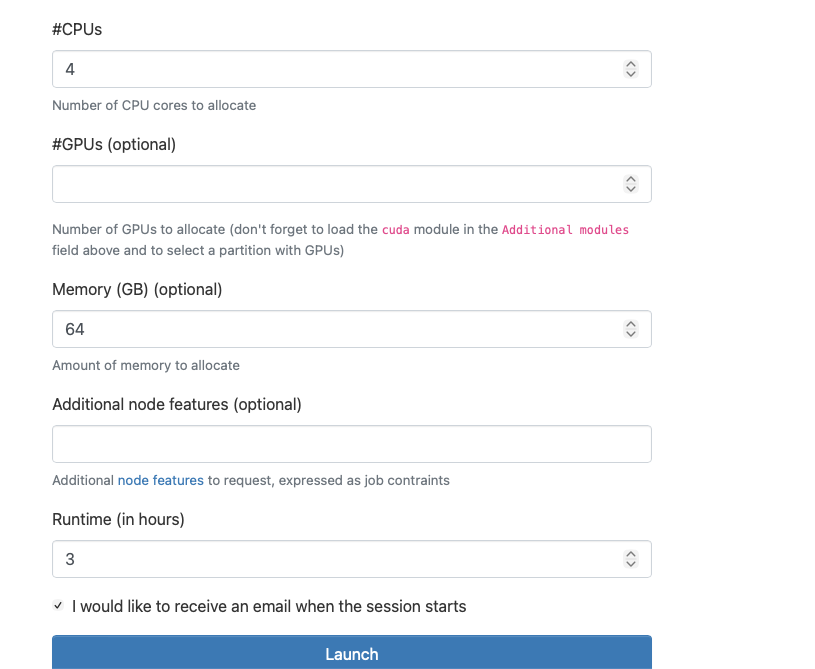

# What resources might you request in HPC?

## CPUs

For any HPC job, you'll need some number of CPUs.  These are the central processing units that do operations on a computer!

## Memory

For any HPC job, you'll also need some amount of memory.  This is a data storage location closer to the CPUs that is used for near-term processing.

## Time

You will need to specify an amount of time for your job to run

## GPUs

You may or may not need GPUs (graphical processing units).  These chips can accelerate scientific computation if your code is setup to use them

## Nodes

A node is a physical machine, like your laptop.  By default, most jobs only need and request 1 node.  It's possible to request multiple nodes, and setup your code to distribute tasks across multiple machines.


# How do I request resources?

## OnDemand

## SBATCH

```bash
#!/bin/bash
#SBATCH --job-name=my_job             # Job name
#SBATCH --output=my_job_%j.out        # Output file name (%j expands to jobId)
#SBATCH --error=my_job_%j.err         # Error file name
#SBATCH --cpus=4                       # Total number of CPUs requested
#SBATCH --mem=16G                      # Total memory limit
#SBATCH --time=02:00:00                # Time limit hrs:min:sec
#SBATCH --gpus=2                       # Number of GPUs requested
#SBATCH --nodes=1                      # Number of nodes requested

# Load any necessary modules (if applicable)
module load your_module_name

# Execute your application
srun your_application_executable
```
# Strategies for your first request

All of the resources above have different behaviors - so you need to think about them a little differently.

## CPUs

It's very common for programming languages to only use 1 CPU, unless told to do otherwise
It's also very common for libraries or packages to automatically use multiple CPUs.  You should read the documentation on the specific software you use

For your first request, I would recommend somewhere between 1 and 8 CPUs.  Then, you can use the tools available to determine if you need more.

## Memory

Overall, you should be sure to request too much memory.  If you run out of memory, your job will fail.

### Ellianna's Rule

Ellianna's rule of thumb is to take your dataset size, and how many copies of it you make of it, and add 10-25% of overhead.

For example - if you have a 50GB dataset, and you make 1 copy of it, then you should request 110-125GB of memory.

### Brian's Rule

Brian's rule of thumb is to ask for a lot of memory at first.  If your dataset is 50GB, I would just ask for 128GB.  If you run out of memory, I would double your memory.

When you have a working solution, you can look back at the actual memory used, and fine tune later.

## Time

Like memory, you also need to request too much time.  If your time limit comes and your job is still running, it will be killed without finishing.

One strategy would be to ask for the maximum amount of time, and fine tune later.  In `serc`, the max time is 7 days.

## GPUs

If you're unsure on how many GPUs to request, I would request 1.  Using multiple GPUs is an advanced topic, and I would recommend starting with 1 unless you are familiar with multi-GPU computing.

## Nodes

Similar to GPUs, I would start with 1 node.  Multi-node computing is an advanced topic - and so I would recommend starting with 1 node unless you are familiar with multi-node computing.
