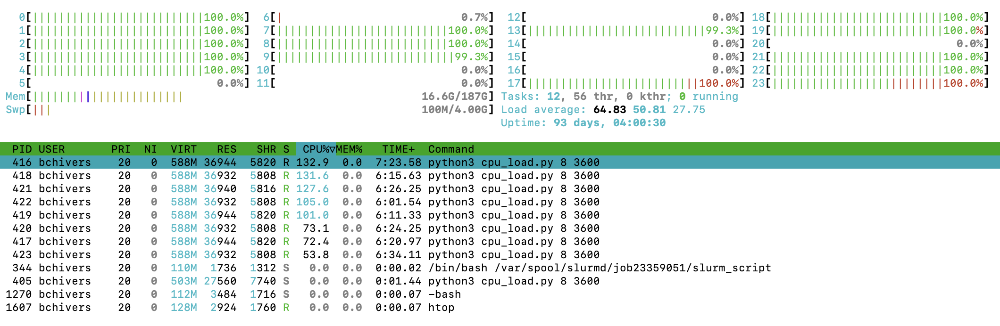

# Tools for Tracking Resource Utilization

## Tools for tracking while the job is running

### Top / htop

We're going to start by submitting the following job:

```bash
sbatch cpu_hog.submit
```

When this job starts, let's login to the node and run `htop` to view utilization.  You'll see something like this:



If you see many more threads, press Shift+H to switch from threads to processes.

