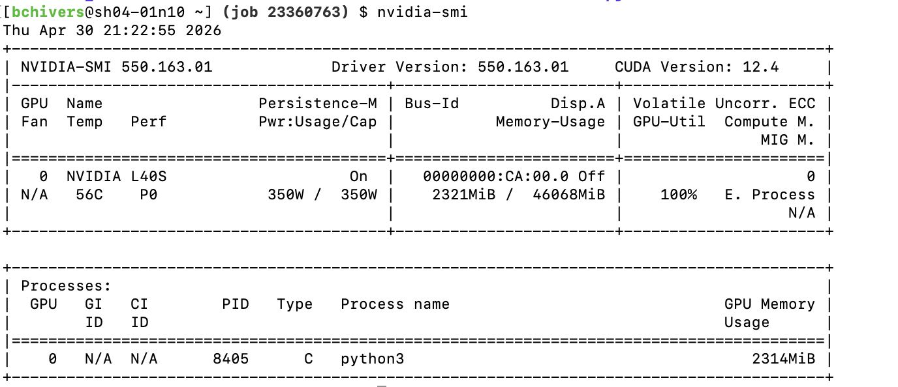
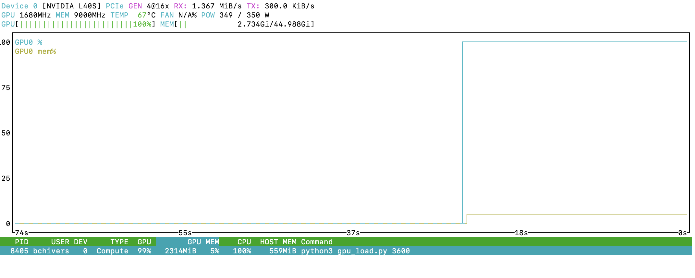
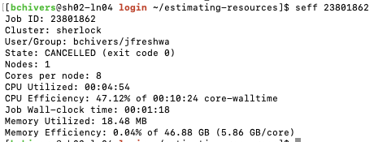
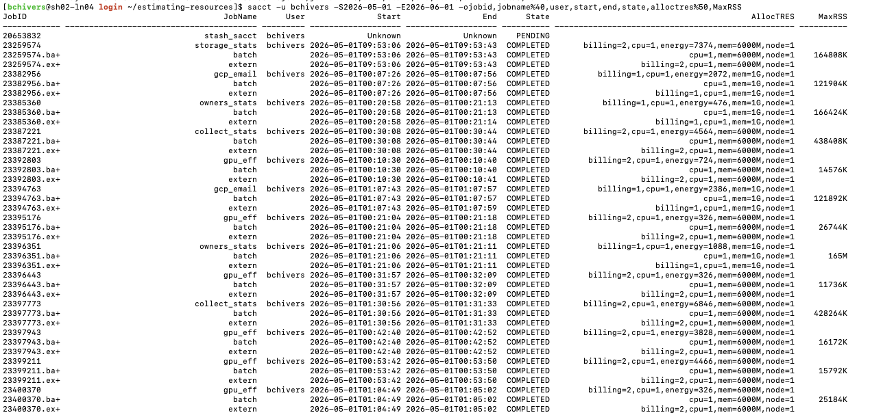

# Tools for Tracking Resource Utilization

## Tools for tracking while the job is running

### Top / htop

We're going to start by submitting the following job:

```bash
sbatch cpu_hog.submit
```

When this job starts, let's login to the node and run `htop` to view utilization.  You'll see something like this:


If you see many more threads, press Shift+H to switch from threads to processes.

### nvidia-smi / nvtop

For GPUs, were going to submit the following job:

```bash
sbatch gpu_hog.submit
```
When this job starts, let's login to the node and run `nvidia-smi` to view utilization.  You'll see something like this:

From this, you can see that you have a process on the GPU, and that GPU memory is being used.

You might also find `nvtop` useful.  You can load `nvtop` on Sherlock with `ml system nvtop`, and then run with `nvtop` to see something like this:



There's another good tool for watching your GPU usage called `nvtop`.  Here's what that looks like:



## Tools for tracking after the job is done

### seff

 `seff` stands for Slurm Efficiency, and will give you a report of your jobs efficiency like this:

 ```bash
seff 23801862
```




 ### sacct

 `sacct` stands for Slurm Accounting.  This is the database of job information that Sherlock holds for 6 months.  Here's an example query where I request information about my job:

 ```bash
sacct -u bchivers -S2026-05-01 -E2026-06-01 -ojobid,jobname%40,user,start,end,state,alloctres%50,MaxRSS
```




## Estimating Resources Beyond the First Request

It's a big trade off between:
* small jobs will get through the queue faster, but may run slower
* big jobs might wait longer, but process quicker

[SERC Utilization Dashboard](https://datastudio.google.com/reporting/c0249b86-4271-4473-adb6-ccf06d2a8b39)

[Owners GPU Dashboard](https://datastudio.google.com/reporting/ca4a8b78-8608-4acb-8fc8-2fb1ee5584f6)
